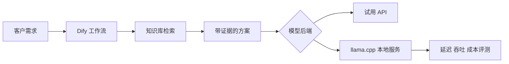

# AI Presales Lab

一个面向 AI 售前岗位的差异化作品集：

1. 应用层：基于 Dify 搭建企业 AI 解决方案售前助手
2. 基础设施层：基于 llama.cpp 在 Colab CUDA（本机也支持 Apple Silicon Metal）上运行本地量化模型并评测性能

这两个项目共享一套合成客户需求和结果契约，但不重复实现第二套 RAG 或 Agent。前者回答“如何把模型能力交付成客户可用的方案”，后者回答“如何把模型部署成可测量、可选型的服务”。

## 当前可运行内容

- 无 API Key 的离线方案引擎、知识检索和 24 条评测案例
- Dify App API 客户端，密钥只在服务端读取
- llama.cpp OpenAI-compatible 客户端，支持普通调用和 SSE 流式首 Token 测量
- llama.cpp 并发基准脚本，记录聚合吞吐、CPU RSS 和 NVIDIA GPU VRAM
- 可直接上传到 Google Colab 的 Q4/Q8 CUDA 实测 notebook
- Gradio 演示页面（可选依赖）
- Dify 工作流配置说明、输出契约和面试材料

## 目录

```text
.
├── data/knowledge/          合成产品与部署资料
├── data/evaluation/         24 条客户需求黄金问题集
├── dify/                    Dify 工作流说明和响应契约
├── llama_cpp/               本地推理服务复现说明
├── notebooks/               Colab 实测 notebook
├── src/ai_presales_lab/     共享契约、检索和 API 适配器
├── scripts/                 Demo、评测、启动和压测脚本
├── demo/                    可选 Gradio 页面
├── docs/                    架构、选型、演示、简历和面试材料
└── tests/                   不依赖外部服务的自动化测试
```

## 快速开始

项目核心代码只使用 Python 标准库；开发测试使用 pytest。建议在 Python 3.12 虚拟环境中安装：

```bash
python3 -m venv .venv
source .venv/bin/activate
python -m pip install -e '.[dev]'
```

运行离线 Demo：

```bash
PYTHONPATH=src python scripts/run_demo.py --case-id case-001
```

运行 24 条离线评测：

```bash
make eval
```

运行测试：

```bash
make test
```

启动可选 Gradio 页面：

```bash
python -m pip install -e '.[demo]'
PYTHONPATH=src python demo/gradio_app.py --mode mock
```

## Dify 应用层复现

按照 [`dify/README.md`](dify/README.md) 启动 Dify、导入 `data/knowledge/` 资料，并按 [`dify/system_prompt.md`](dify/system_prompt.md) 配置工作流。配置完成后：

```bash
cp .env.example .env
set -a
source .env
set +a
PYTHONPATH=src python scripts/run_demo.py --mode dify --case-id case-001 --json
```

Dify 应用的输出需要与 [`dify/output_schema.json`](dify/output_schema.json) 对齐；[`dify/workflow_contract.json`](dify/workflow_contract.json) 是一份示例响应。没有 API Key 时不要修改代码，先用 mock 模式验证输入、输出和评测流程。

## llama.cpp 基础设施复现

本项目的可比 Q4/Q8 报告优先使用 [`notebooks/llama_cpp_colab_benchmark.ipynb`](notebooks/llama_cpp_colab_benchmark.ipynb) 在 Colab GPU 中生成；完整协议见 [`docs/colab-runbook.md`](docs/colab-runbook.md)。它固定模型 revision、llama.cpp commit、上下文、采样参数、请求数和并发度，并记录 GPU/CPU 内存。

本机 Apple Silicon 仍可按 [`llama_cpp/README.md`](llama_cpp/README.md) 构建并启用 Metal，启动 `llama-server` 后执行：

```bash
PYTHONPATH=src python scripts/benchmark_llama.py \
  --label q4-metal-c1 \
  --requests 5 \
  --concurrency 1 \
  --output data/results/q4-metal-c1.json
```

分别运行不同量化等级、上下文长度和并发数，最后将实际结果填入评测报告。模型文件不提交到 GitHub。

部署选型的决策顺序见 [`docs/deployment-decision.md`](docs/deployment-decision.md)。

## 架构概览



## 诚实披露

本仓库基于 Dify 和 llama.cpp 的公开能力构建个人演示。简历只描述自己编写的适配器、数据、工作流、评测和部署工作，不把上游功能写成从零开发。所有性能和质量数字以 `data/results/` 中实际生成的报告为准。

上游项目：

- [Dify](https://github.com/langgenius/dify)
- [llama.cpp](https://github.com/ggml-org/llama.cpp)
