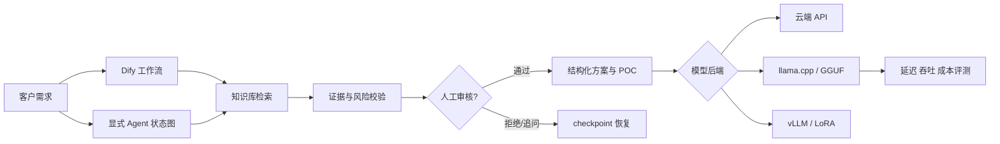

# AI Presales Lab

一个面向 AI 解决方案售前岗位的端到端作品集，围绕“制造业设备运维知识助手”旗舰案例，展示从客户需求到可验收 POC、Agent、模型策略、微调实验和部署选型的完整交付能力。

核心问题不是“让模型回答一句话”，而是：客户约束不完整、产品资料会变化、数据可能不能出域、方案必须可追溯时，如何把 AI 能力变成一套可解释、可审核、可复现的售前交付流程。

## 当前可运行内容

- 无 API Key 的离线 RAG/方案基线、24 条黄金案例和结构化 schema 校验
- 显式状态 Agent：需求 → 检索 → 架构 → POC → 模型策略 → 风险门 → 输出
- SQLite checkpoint、人审 `approve/reject` 恢复、run/trace/thread 可观测记录
- Dify 工作流/API 适配、OpenAI-compatible 本地 Agent API 和 Gradio 三种演示模式
- RAG-first 的模型决策：云 API、llama.cpp/GGUF、本地轻量服务和 vLLM GPU 路径
- 可复现的合成微调数据、case-level split、manifest/hash、TRL+PEFT QLoRA 和 LLaMA Factory 配置
- Prompt injection、无依据承诺、敏感信息和过度代理红队检查
- llama.cpp OpenAI-compatible 客户端、SSE 首 Token 和并发基准；Colab CUDA / Apple Silicon Metal 实测入口
- 面试材料：架构、POC、TCO/容量、实施计划、演示脚本、简历 bullet 和上游归属

## 目录

```text
.
├── data/knowledge/          合成产品与部署资料
├── data/evaluation/         24 条客户需求黄金问题集
├── data/finetuning/         版本化 ShareGPT-style 微调数据与 manifest
├── configs/finetune/        TRL/PEFT 与 LLaMA Factory 配置
├── dify/                    Dify 工作流说明和响应契约
├── llama_cpp/               本地推理服务复现说明
├── notebooks/               Colab 实测 notebook
├── src/ai_presales_lab/     Agent、契约、检索、API、持久化和安全策略
├── scripts/                 Demo、评测、Agent、数据和训练脚本
├── security/                红队案例和 Promptfoo 配置
├── deploy/                  非 root Agent 容器和 compose 样例
├── demo/                    可选 Gradio 页面
├── docs/                    架构、选型、演示、简历和面试材料
└── tests/                   不依赖外部服务的自动化测试
```

## 快速开始

项目核心代码只使用 Python 标准库；开发测试使用 pytest/ruff。建议在 Python 3.12 虚拟环境中安装：

```bash
python3 -m venv .venv
source .venv/bin/activate
python -m pip install -e '.[dev]'
```

一次性验证主要链路：

```bash
make test
make lint
make eval
make agent-eval
make security-check
make build-finetune-dataset
make dataset-check
make finetune-dry-run
```

运行离线 Demo：

```bash
PYTHONPATH=src python scripts/run_demo.py --case-id case-001
```

运行 24 条离线评测：

```bash
make eval
```

运行测试：

```bash
make test
```

## Agent 与人工审核

运行制造业高风险案例：

```bash
PYTHONPATH=src python scripts/run_agent.py \
  --case-id case-001 \
  --db .runtime/agent/demo.db \
  --trace .runtime/agent/case-001.jsonl

# 查看 JSON/trace 后，恢复同一个 checkpoint
PYTHONPATH=src python scripts/run_agent.py \
  --case-id case-001 \
  --approve \
  --db .runtime/agent/demo.db
```

首次运行会在 `pending_review` 停下；通过后才会完成最终方案。也可以 `--reject` 验证拒绝路径。启动本地 API：

```bash
PYTHONPATH=src python scripts/serve_agent.py --port 8090
```

接口示例见 [`docs/api.md`](docs/api.md)，节点、状态和生产化边界见 [`docs/agent-design.md`](docs/agent-design.md)。

启动可选 Gradio 页面：

```bash
python -m pip install -e '.[demo]'
PYTHONPATH=src python demo/gradio_app.py --mode mock
```

使用 Agent 模式并演示人工审核：

```bash
PYTHONPATH=src python demo/gradio_app.py --mode agent
```

## Dify 应用层复现

按照 [`dify/README.md`](dify/README.md) 启动 Dify、导入 `data/knowledge/` 资料，并按 [`dify/system_prompt.md`](dify/system_prompt.md) 配置工作流。配置完成后：

```bash
cp .env.example .env
set -a
source .env
set +a
PYTHONPATH=src python scripts/run_demo.py --mode dify --case-id case-001 --json
```

Dify 应用的输出需要与 [`dify/output_schema.json`](dify/output_schema.json) 对齐；[`dify/workflow_contract.json`](dify/workflow_contract.json) 是一份示例响应。没有 API Key 时不要修改代码，先用 mock 模式验证输入、输出和评测流程。

## 微调与模型策略

先用 Prompt + RAG 建立基线，再判断是否需要 LoRA/QLoRA。微调数据由 24 个源案例生成 72 条可追溯对话，按案例隔离 train/dev/test，配置和运行手册见 [`docs/fine-tuning.md`](docs/fine-tuning.md)。本机没有 CUDA 时只运行：

```bash
make finetune-dry-run
```

真实 QLoRA 需在 Colab CUDA 或其他兼容 GPU 上执行 [`notebooks/qlora_colab.ipynb`](notebooks/qlora_colab.ipynb)，完整步骤见 [`docs/colab-qlora-runbook.md`](docs/colab-qlora-runbook.md)。仓库不声称已产生 GPU adapter 指标，除非对应原始报告已经提交到 `data/results/`。

## llama.cpp 基础设施复现

本项目的可比 Q4/Q8 报告优先使用 [`notebooks/llama_cpp_colab_benchmark.ipynb`](notebooks/llama_cpp_colab_benchmark.ipynb) 在 Colab GPU 中生成；完整协议见 [`docs/colab-runbook.md`](docs/colab-runbook.md)。它固定模型 revision、llama.cpp commit、上下文、采样参数、请求数和并发度，并记录 GPU/CPU 内存。

本机 Apple Silicon 仍可按 [`llama_cpp/README.md`](llama_cpp/README.md) 构建并启用 Metal，启动 `llama-server` 后执行：

```bash
PYTHONPATH=src python scripts/benchmark_llama.py \
  --label q4-metal-c1 \
  --requests 5 \
  --concurrency 1 \
  --output data/results/q4-metal-c1.json
```

分别运行不同量化等级、上下文长度和并发数，最后将实际结果填入评测报告。模型文件不提交到 GitHub。

部署选型的决策顺序见 [`docs/deployment-decision.md`](docs/deployment-decision.md)。

## 架构概览



## 当前证据与诚实披露

最近一次本机离线验证：18 项测试通过；24 条 Agent 案例完成并通过 schema/POC/模型策略/证据规则/审核门；红队 12/12；微调数据 train/dev/test 为 42/12/18。详细口径见 [`docs/evaluation.md`](docs/evaluation.md)。这些是工程契约结果，不是生产准确率、SLA 或容量。

本仓库基于 Dify、llama.cpp 和 Hugging Face 生态的公开能力构建个人演示。简历只描述自己编写的适配器、数据、工作流、评测和部署工作，不把上游功能写成从零开发。所有性能和质量数字以 `data/results/` 中实际生成的报告为准。

更完整的 2–3 周交付安排见 [`docs/implementation-plan.md`](docs/implementation-plan.md)；安全边界见 [`docs/security-and-governance.md`](docs/security-and-governance.md)；GitHub 上游研究见 [`docs/technology-rationale.md`](docs/technology-rationale.md)。

上游项目：

- [Dify](https://github.com/langgenius/dify)
- [llama.cpp](https://github.com/ggml-org/llama.cpp)
- [LangGraph](https://github.com/langchain-ai/langgraph)
- [TRL](https://github.com/huggingface/trl)
- [LLaMA Factory](https://github.com/hiyouga/LLaMA-Factory)
- [vLLM](https://github.com/vllm-project/vllm)
