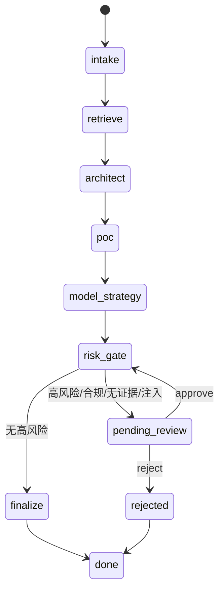

# Agent 设计与生产化边界

## 设计原则

1. **显式状态优先**：每一步都有输入、输出和可观察事件，避免一个不可解释的大 Prompt。
2. **工具最小权限**：Agent 只能搜索知识、校验证据、估算容量输入和比较部署路径；不提供任意代码执行、生产写入或外发消息工具。
3. **证据绑定**：产品能力结论必须绑定 `evidence_id` 和来源路径；没有证据时转成风险和澄清问题。
4. **人机协同**：高风险、数据出域、合规约束、疑似注入或缺少知识覆盖时暂停，等待人工审核。
5. **可恢复**：每个线程保存 checkpoint，审核后从风险门继续，而不是重新生成一份不可对比的答案。
6. **可替换模型**：应用层通过结构化契约和 OpenAI-compatible API 与 Dify、云 API、vLLM、llama.cpp 解耦。

## 状态机



## 节点职责

| 节点 | 主要输入 | 主要输出 | 失败处理 |
|---|---|---|---|
| `intake` | `CustomerBrief` | 需求、初始风险、澄清问题 | 标记缺失字段，不猜测客户约束 |
| `retrieve` | 行业、场景、部署、数据、合规 | 证据列表、证据校验、容量输入 | 空召回进入知识覆盖风险 |
| `architect` | 需求与证据 | 架构组件、部署选项、推荐原则 | 不把检索片段直接当作承诺 |
| `poc` | 需求、证据 | 四阶段 POC、交付物、退出标准 | 资料不足时保持“先补资料” |
| `model_strategy` | 部署与并发约束 | RAG/微调/量化/服务决策记录 | 输出待验证输入，不给伪造容量 |
| `risk_gate` | 全部状态 | `pending_review` 或放行 | 高风险停在人工审核 |
| `finalize` | 审核状态与全量状态 | `SolutionResponse` | schema、敏感数据和承诺策略阻断 |

## 状态与恢复

本仓库的依赖无关核心使用 SQLite `CheckpointStore`，保存 `AgentState` 的 JSON 快照；本地演示通过：

```bash
PYTHONPATH=src python scripts/run_agent.py --case-id case-001 --db .runtime/agent/demo.db
PYTHONPATH=src python scripts/run_agent.py --case-id case-001 --approve --db .runtime/agent/demo.db
```

第一个命令会在 `pending_review` 停下，第二个命令加载相同线程并继续。生产环境应补齐认证、租户隔离、数据库备份、幂等键、审计留存策略和并发冲突处理。

## LangGraph 适配边界

`src/ai_presales_lab/langgraph_adapter.py` 提供可选的线性 StateGraph 适配器；核心 CI 不强制安装 LangGraph，因此在无网络、无额外依赖的情况下仍可运行。若部署到生产，建议将 `risk_gate` 包装为 LangGraph `interrupt()`，使用持久化 checkpointer，以便通过 `Command(resume=...)` 恢复人工决策。

本项目没有把“安装了 LangGraph”当成能力证明：面试时应展示节点边界、状态契约、审核恢复、工具权限和评测证据。

实现依据：[LangGraph checkpointers](https://github.com/langchain-ai/docs/blob/main/src/oss/langgraph/checkpointers.mdx) 将状态按 thread 保存，支持中断后的恢复；[LangGraph interrupt 类型说明](https://github.com/langchain-ai/langgraph/blob/main/libs/langgraph/langgraph/types.py) 明确 interrupt 需要启用 checkpointer。

## 生产化缺口清单

- API：OIDC/JWT、租户隔离、请求限流、审计访问控制和幂等。
- 数据：文档权限继承、删除/撤回、版本标签、PII 分类和向量库生命周期。
- 模型：模型/Tokenizer/Adapter/量化文件 digest、回滚和兼容性矩阵。
- 运行：OTel trace、指标告警、队列、重试预算、超时和人工兜底。
- 评测：固定黄金集、对抗集、回归阈值、人工抽检和线上漂移监控。
